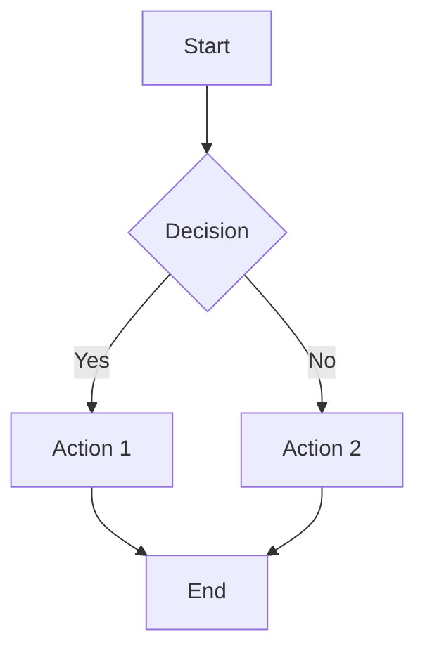

# md2pdf-cli 📄

A powerful command-line tool to convert Markdown files to beautifully formatted PDFs with full Mermaid diagram support.

## ✨ Features

- **🎨 Beautiful PDF Output**: A4-wide, infinite-scroll PDFs with clean formatting
- **📊 Mermaid Support**: Full support for Mermaid diagrams (flowcharts, sequence diagrams, etc.)
- **🖥️ Interactive CLI**: User-friendly prompts when run without arguments
- **👀 Watch Mode**: Auto-regenerate PDFs when markdown files change
- **📦 Batch Processing**: Convert multiple files at once using glob patterns
- **⚡ Progress Indicators**: Visual feedback during conversion
- **🎯 Zero Configuration**: Works out of the box with sensible defaults

## 🚀 Installation

### Global Installation (Recommended)
```bash
npm install -g markdown-to-pdf-cli
```

### Local Installation
```bash
npm install markdown-to-pdf-cli
npx md2pdf --help
```

## 📖 Usage

### Interactive Mode
Simply run without arguments for guided prompts:
```bash
md2pdf
```

### Command Line Options
```bash
# Convert a single file
md2pdf -i document.md -o output.pdf

# Use default output filename (document.pdf)
md2pdf -i document.md

# Watch mode - auto-regenerate on changes
md2pdf -i document.md --watch

# Batch convert multiple files
md2pdf --batch "docs/*.md"

# Interactive mode explicitly
md2pdf --interactive
```

### Full Command Reference
```
Options:
  -i, --input <file>        Input markdown file
  -o, --output <file>       Output PDF file
  -c, --config <file>       Optional config file (JSON)
  -w, --watch               Watch mode - regenerate PDF when markdown file changes
  -b, --batch <pattern>     Batch process multiple files using glob pattern
  --interactive             Interactive mode with prompts
  -h, --help               Display help for command
  -V, --version            Display version number
```

## 📝 Markdown Support

### Standard Markdown
- Headers, paragraphs, lists
- Code blocks with syntax highlighting
- Tables, links, images
- Bold, italic, strikethrough text

### Mermaid Diagrams
Full support for all Mermaid diagram types:

````markdown

````

Supported diagram types:
- Flowcharts
- Sequence diagrams
- Class diagrams
- State diagrams
- Entity relationship diagrams
- User journey diagrams
- Gantt charts
- Pie charts
- And more!

## 🛠️ Examples

### Basic Conversion
```bash
md2pdf -i README.md
# Creates README.pdf
```

### Watch Mode for Development
```bash
md2pdf -i documentation.md --watch
# Automatically regenerates PDF when documentation.md changes
```

### Batch Processing
```bash
# Convert all markdown files in docs folder
md2pdf --batch "docs/*.md"

# Convert all markdown files recursively
md2pdf --batch "**/*.md"
```

### Interactive Mode
```bash
md2pdf --interactive
# Guided prompts for file selection and options
```

## 🔧 Configuration

Create a `config.json` file for custom settings:
```json
{
  "theme": "neutral",
  "pageWidth": "210mm",
  "margin": {
    "top": "20mm",
    "right": "20mm",
    "bottom": "20mm",
    "left": "20mm"
  }
}
```

Use with:
```bash
md2pdf -i document.md -c config.json
```

## 📋 Requirements

- Node.js 16 or higher
- Chrome/Chromium (automatically downloaded by Puppeteer)

## 🤝 Contributing

Contributions are welcome! Please feel free to submit a Pull Request.

## 📄 License

MIT License - see [LICENSE](LICENSE) file for details.

## 🐛 Issues

Found a bug or have a feature request? Please open an issue on [GitHub](https://github.com/yourusername/md2pdf-cli/issues).

## 💡 Tips

- Use descriptive filenames for better organization
- Mermaid diagrams render best with clean, simple syntax
- Watch mode is perfect for iterative document development
- Batch processing saves time when converting multiple files
- Interactive mode is great for occasional use

---

Made with ❤️ for the developer community