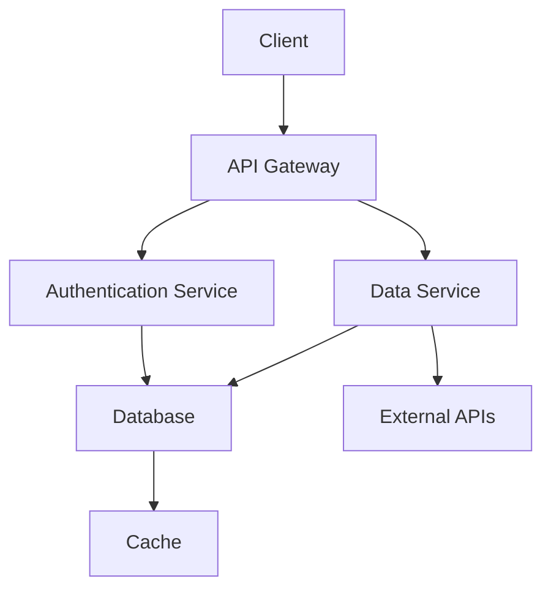
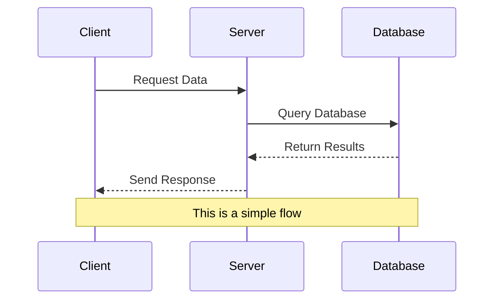
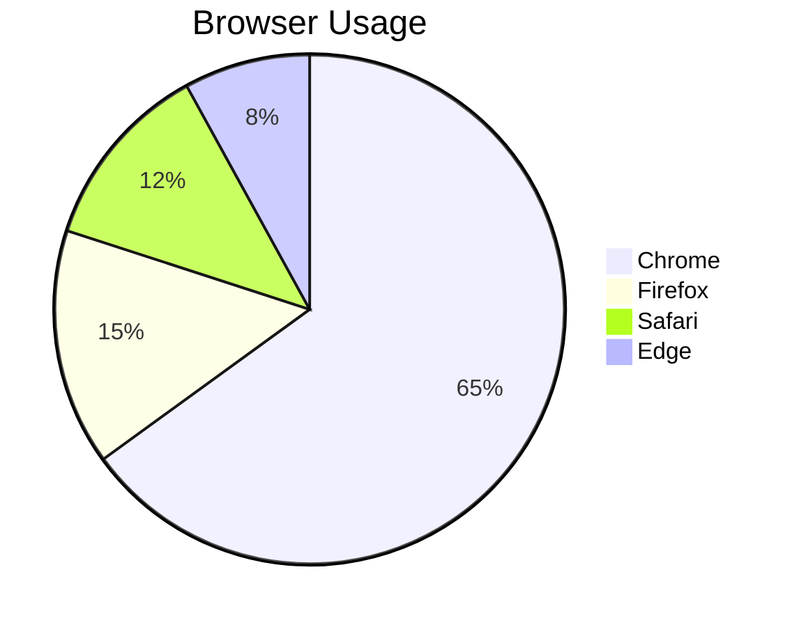

# Long Document Test

This document tests the infinite scroll PDF generation with lots of content.

## Section 1: Introduction

Lorem ipsum dolor sit amet, consectetur adipiscing elit. Sed do eiusmod tempor incididunt ut labore et dolore magna aliqua. Ut enim ad minim veniam, quis nostrud exercitation ullamco laboris.

### Subsection 1.1

Duis aute irure dolor in reprehenderit in voluptate velit esse cillum dolore eu fugiat nulla pariatur. Excepteur sint occaecat cupidatat non proident, sunt in culpa qui officia deserunt mollit anim id est laborum.

## Section 2: Technical Details

Here's some code:

```javascript
function processData(data) {
    return data
        .filter(item => item.active)
        .map(item => ({
            id: item.id,
            name: item.name,
            status: 'processed'
        }));
}
```

### Subsection 2.1: Architecture



## Section 3: Data Flow

Another diagram showing the process:



## Section 4: Implementation

Here's a longer code block:

```python
class DataProcessor:
    def __init__(self, config):
        self.config = config
        self.cache = {}
        
    def process_batch(self, items):
        results = []
        for item in items:
            if item.id in self.cache:
                results.append(self.cache[item.id])
            else:
                processed = self.transform_item(item)
                self.cache[item.id] = processed
                results.append(processed)
        return results
    
    def transform_item(self, item):
        # Complex transformation logic
        transformed = {
            'id': item.id,
            'data': self.normalize_data(item.raw_data),
            'metadata': self.extract_metadata(item),
            'timestamp': datetime.now().isoformat()
        }
        return transformed
    
    def normalize_data(self, raw_data):
        # Data normalization
        return {k.lower(): v for k, v in raw_data.items()}
    
    def extract_metadata(self, item):
        return {
            'source': item.source,
            'version': self.config.version,
            'processed_by': 'DataProcessor'
        }
```

## Section 5: Configuration Table

| Configuration | Value | Description |
|---------------|-------|-------------|
| `max_items` | 1000 | Maximum items per batch |
| `timeout` | 30s | Request timeout |
| `retry_count` | 3 | Number of retries |
| `cache_ttl` | 300s | Cache time-to-live |
| `log_level` | INFO | Logging level |

## Section 6: More Content

This section has a lot of text to make the document longer and test the infinite scroll properly.

### Lists and More Lists

1. First major point
   - Sub-point one
   - Sub-point two
   - Sub-point three
2. Second major point
   - Another sub-point
   - Yet another sub-point
3. Third major point

### Blockquotes

> This is an important quote that spans multiple lines and should be clearly visible in the PDF output. It demonstrates how blockquotes are rendered in the infinite scroll format.

### Another Diagram



## Section 7: Final Thoughts

This document should generate a very long PDF that clearly shows the infinite scroll nature - one continuous page without any breaks.

The content flows naturally from top to bottom without artificial page boundaries, making it perfect for digital reading and long-form documentation.

### End Notes

- Point one about the system
- Point two about performance
- Point three about scalability
- Point four about maintenance
- Point five about future improvements

## Conclusion

This concludes our long test document for the infinite scroll PDF generation feature.