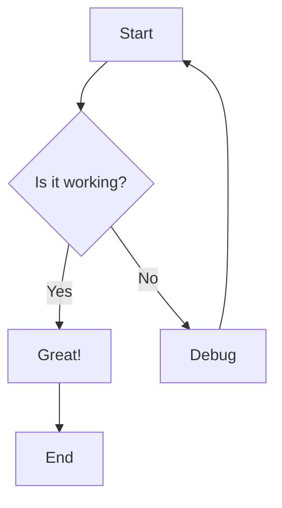

# Test Document

This is a test markdown file to verify the md2pdf converter works correctly.

## Features

- **Bold text**
- *Italic text*
- `Code inline`

## Code Block

```javascript
function hello() {
    console.log("Hello, world!");
}
```

## Mermaid Diagram



## Table

| Feature | Status |
|---------|--------|
| Markdown | ✅ |
| Mermaid | ✅ |
| Interactive CLI | ✅ |

## List

1. First item
2. Second item
   - Nested item
   - Another nested item
3. Third item

That's all for now!